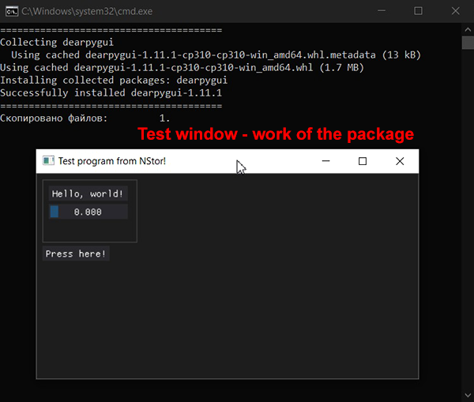

**Портабельная версия питона 3.12.2 с GIT и PIP для Windows с тестом графического интерфейса!**

> **Embedded python 3.12.2 package with built PIP & GIT for Windows with GUI test!**

---

Для разработчиков Python-приложений: пустой портабельный пакет "Python+PIP+GIT" со всеми настройками и тестовыми bat-файлами. Тест графического интерфейса!

> For Python application developers: empty portable packages "Python+PIP+GIT" with all settings and bat files for testing GUI-interface!

---

Распаковать архи в новую папку. Запустить тестовые "**run_demo_gui.bat\*\***" или "**run_test_pip_git.bat\*\***".

> Unzip the archive nto a new folder. Start "run_demo_gui.bat" or "run_test_pip_git.bat" for testing.

---

Дальше объяснять не буду, сами все поймете, смотрите bat-фалы.

> I will not explain further, you will understand everything yourself, see bat-files.

---

Удачи! )
Good luck!)
@srigert
https://t.me/stable_cascade_rus
